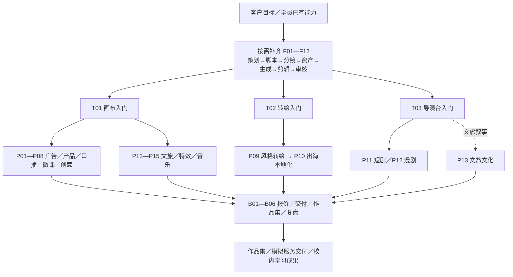

# AIGC视频创作原子课程菜单

开放大学内部课程与社会培训共用版｜建议稿 v1.0｜2026年9月21日

## 课程定位与设计原则

建议以“能完成一种视频任务”为课程售卖单位，以“能交付一项客户服务”为组课目标。对外用场景命名课程，对内用能力代码组织课程。沿用原银行培训的需求—选题—脚本—分镜—资产—生成—剪辑—审核主线，将银行专属例子替换为教育、商家、产品、文化与个人创作场景。

本菜单共36门、54小时：12门通用基础课（12小时）、3门工具入门课（6小时）、15门案例实战课（30小时）、6门职业交付课（6小时）。这是可选课库的容量，不要求学员全部学习。Part A和Part B只作为内容标签；每一门实战课都包含必要背景知识、工具示范和案例跟练。

这里的1—2小时指净教学时间，1小时=60分钟；每天按6小时排课，另留课间与午休。面向校内录播时，每门模块再拆成若干5—15分钟知识视频、操作视频和练习，避免把两小时连续视频当作一个微课视频。若学校按45分钟/学时管理，6小时相当于8学时；学分认定由学校确定。

单课选购不要求把基础课全部学完。T01/T02/T03是相应工具路径的操作入门；P类课需具备对应工具基本操作，或课前完成等效操作检核。F类是可独立补齐的知识技能。B类可用教师提供的样片与任务书开展。所有生成练习默认已完成账号登录、软件安装、素材准备和额度检查。

## 方向取舍：先推出什么

以下优先级是结合公开资料、课堂可实现性与服务交付清晰度作出的课程产品判断，不是市场规模排名。

- 第一批主推：电商产品视频、商家宣传、数字人口播、教育微课。客户对象、交付格式和验收边界较容易写清楚，适合零基础社会学员和校内教师。
- 第二批进阶：TVC概念广告、原创知识视频、转绘本地化、短剧单场景。制作判断与修改能力要求更高，适合进阶学习与细分服务。
- 特色选修：漫剧、文旅文化、实拍加特效、音乐视觉、传播创意。用于形成课程辨识度和作品集差异。
- “爆款”课程定位为传播结构与实验课，不承诺播放量；“兼职”定位为服务能力与模拟商业交付，不承诺接单或收入。
- 原创资产、镜头控制、声音剪辑、沟通交付与数据复盘作为长期能力；模型版本和热点案例作为可替换教学材料。

建议首轮试运行选择12门：F01、F03、F04、F12、T01、T02、T03、P02、P05、P06、P09、P11，共20小时。先验证三工具教学流程和典型案例完成率，再扩展全菜单。“首发”标签表示适合优先开发，不表示36门已经完成课件或功能验证。

## 三款工具的教学分工与边界

| 工具 | 以用户介绍为依据的定位 | 对应课程 | 开课前须验证 |
|---|---|---|---|
| 画布 | 组织创意、资产和视频制作 | T01；P01—P08、P13—P15 | 实际素材组织、参考图、镜头生成、项目复用与导出流程 |
| 转绘 | 对已有视频反推并进行转绘 | T02；P09、P10 | 可处理素材格式、反推粒度、风格与时序控制、镜头长度及输出限制 |
| 导演台 | 从剧本走向短剧成片 | T03；P11、P12，可支持P13 | 剧本输入、分镜修改、角色一致性、镜头替换、声音及导出能力 |

当前未收到三款工具的新版教程，以上不代表全部功能已实测。数字人、声音克隆、多语种配音、字幕、合成和精细剪辑统一按“配套能力”设计；是否内置、是否需要外接、可否商用需在教程审阅和试讲中确认。无需因此延后课程菜单设计。普通F类练习由教师提供工程与素材；未学工具入门的学员也可完成指定知识点练习。

## 每门课怎样教

1小时能力课：10分钟案例与问题，15分钟方法，25分钟练习，10分钟讲评。2小时项目课：15分钟背景和验收目标，20分钟示范，60分钟跟练，15分钟剪辑与检查，10分钟展示。关键知识在项目中即时补充，避免多天组合反复讲完整基础。

P类项目默认提供可改写的脚本、已授权素材、项目模板与生成候选，课堂至少亲手完成一次关键生成和一次有理由的修改。网络排队或模型失败时可用预生成素材继续剪辑，但须标明哪些步骤是本人实际完成。课堂成果为限定长度的可播放样片；独立原创、复杂角色调度和商业精修需要额外练习与客户验收。

## 完整课程菜单

### 通用基础

#### F01 AIGC视频入门：一条片子的生产地图（1小时）

建立从需求到交付的全流程认知，知道每一步应该产出什么。

- 教学简纲：拆解30秒样片 → 区分文案、图像、视频与剪辑 → 比较三工具路径 → 制定首个练习任务。
- 课堂成果：一张个人视频生产流程图。
- 工具：通用／三工具概览。适用场景：所有学员。
- 门槛：无需前置课程；按课前材料要求准备。层级：入门。

#### F02 把需求讲清楚：从客户想法到创作任务书（1小时）

把“做得高级一点”等模糊要求转成可执行的创作约束。

- 教学简纲：确认受众与用途 → 锁定单一核心信息 → 约定时长、比例与风格 → 形成验收条件。
- 课堂成果：一页创作任务书与验收要点。
- 工具：通用。适用场景：机构宣传／商家服务。
- 门槛：无需前置课程；按课前材料要求准备。层级：入门。

#### F03 选题与开头：让观众愿意继续看（1小时）

围绕用户问题、情绪和利益点，设计可测试的选题与前三秒开头。

- 教学简纲：识别受众问题 → 拆解信息缺口与冲突 → 生成三种开头 → 排除夸大和标题误导。
- 课堂成果：3个选题、3版开头与选择理由。
- 工具：通用。适用场景：短视频运营／自由创作者。
- 门槛：无需前置课程；按课前材料要求准备。层级：入门。

#### F04 脚本小课：把一个卖点写成30秒故事（1小时）

掌握可拍、可生成、可剪辑的短视频脚本写法。

- 教学简纲：确定一句话主张 → 搭建起承转合 → 写画面、旁白与时长 → 删减无法实现的情节。
- 课堂成果：一份30秒脚本及压缩版。
- 工具：通用。适用场景：广告／科普／剧情。
- 门槛：无需前置课程；按课前材料要求准备。层级：入门。

#### F05 分镜小课：把文字变成镜头清单（1小时）

把脚本拆成可独立生成的短镜头，控制景别和连续性。

- 教学简纲：拆分4—6个镜头 → 安排景别与运动 → 检查动作和视线 → 估算镜头时间。
- 课堂成果：一份4—6镜分镜表。
- 工具：通用／画布。适用场景：广告／短剧。
- 门槛：无需前置课程；按课前材料要求准备。层级：入门。

#### F06 提示词小课：从碰运气到可控修改（1小时）

用结构化描述明确主体、动作、环境、镜头和限制条件。

- 教学简纲：拆解有效提示词 → 保持一个核心动作 → 参考图与文字分工 → 单变量比较两轮结果。
- 课堂成果：一组提示词与修改对照记录。
- 工具：画布＋配套生成能力。适用场景：所有生成任务。
- 门槛：无需前置课程；按课前材料要求准备。层级：入门。

#### F07 角色与产品一致性：建立可复用资产包（1小时）

建立角色、产品、场景与风格参照，减少跨镜头漂移。

- 教学简纲：建立角色或产品卡 → 选择标准参考图 → 锁定造型与色彩 → 核对跨镜头差异。
- 课堂成果：角色／产品卡及3张一致性候选图。
- 工具：画布／导演台。适用场景：品牌／短剧／IP。
- 门槛：无需前置课程；按课前材料要求准备。层级：进阶。

#### F08 关键帧设计：先定画面，再生成运动（1小时）

学习用起始画面、结束目标和动作衔接控制视频镜头。

- 教学简纲：设计首帧构图 → 安排终点画面 → 检查动作可达性 → 比较不同关键帧结果。
- 课堂成果：一组首尾画面与动作说明。
- 工具：画布。适用场景：广告／特效／短剧。
- 门槛：无需前置课程；按课前材料要求准备。层级：进阶。

#### F09 视频生成诊断：镜头为什么失败（1小时）

识别动作畸变、穿帮和运动失控，选择成本较低的修复方案。

- 教学简纲：匹配文生与图生路径 → 控制动作复杂度 → 拆解失败原因 → 比较重生成、替换与剪辑补救。
- 课堂成果：一个镜头的修复前后对照。
- 工具：画布／配套视频模型。适用场景：镜头生产／质检。
- 门槛：无需前置课程；按课前材料要求准备。层级：进阶。

#### F10 配音与声音：让画面有节奏和情绪（1小时）

为短片设计旁白、音乐与音效，保持听感清楚。

- 教学简纲：改写可朗读文本 → 调整语速停顿 → 搭建声音层次 → 检查授权与混音。
- 课堂成果：一段20—30秒声音设计练习。
- 工具：配套音频工具＋剪辑。适用场景：口播／微课／多语种。
- 门槛：无需前置课程；按课前材料要求准备。层级：入门。

#### F11 剪辑与包装：把镜头组装成片（1小时）

用已有素材完成粗剪、字幕、封面与适配导出。

- 教学简纲：按脚本粗剪 → 压缩空镜与停顿 → 统一字幕和音量 → 导出横竖版本。
- 课堂成果：一条15—30秒练习成片。
- 工具：配套剪辑工具。适用场景：所有成片任务。
- 门槛：无需前置课程；按课前材料要求准备。层级：入门。

#### F12 成片审核：质量、授权与AI标识（1小时）

建立交付前的检查习惯，区分课堂样片与可公开发布作品。

- 教学简纲：逐项检查画面与事实 → 核对肖像、声音和素材授权 → 学习生成内容声明与标识 → 整理来源及审核记录。
- 课堂成果：作品自查表与素材来源表。
- 工具：通用／配套剪辑。适用场景：所有公开发布任务。
- 门槛：无需前置课程；按课前材料要求准备。层级：入门。

#### T01 画布工具上手：做出第一条产品短片（2小时）

通过一个低复杂度产品案例，串联策划、图片、视频与成片。

- 教学简纲：认识项目和素材组织 → 改写模板脚本 → 生成关键画面与短镜头 → 拼接、审核并导出。
- 课堂成果：一条10—15秒、2—3镜产品练习片。
- 工具：画布＋配套剪辑。适用场景：产品宣传／创作入门。
- 门槛：无需前置课程；按课前材料要求准备。层级：入门。

#### T02 转绘工具上手：拆解并重做一段视频（2小时）

用自摄或授权素材学习视频反推、风格改写和转绘输出。

- 教学简纲：判断源视频可用性 → 反推镜头和动作 → 改写风格与视觉资产 → 转绘、对照与剪辑。
- 课堂成果：一段5—10秒转绘样片及拆解表。
- 工具：转绘＋配套剪辑。适用场景：风格改编／跨语种内容。
- 门槛：无需前置课程；按课前材料要求准备。层级：入门。

#### T03 导演台上手：从短剧本到剧情样片（2小时）

围绕单场景短剧本体验剧本、分镜、资产和成片的完整流程。

- 教学简纲：输入并校正短剧本 → 确认角色与分镜 → 生成并替换问题镜头 → 拼接、配音与自查。
- 课堂成果：一条20—30秒、单场景剧情练习片。
- 工具：导演台＋配套剪辑。适用场景：短剧／漫剧创作。
- 门槛：无需前置课程；按课前材料要求准备。层级：入门。

#### P01 TVC广告：做一条15秒品牌概念片（2小时）

将一个品牌主张转成有视觉记忆点的商业广告样片。

- 教学简纲：明确品牌主张 → 设计主视觉与3—4镜脚本 → 制作关键镜头 → 完成品牌收尾和质检。
- 课堂成果：一条15秒TVC概念样片与创意说明。
- 工具：画布＋配套剪辑。适用场景：品牌方／广告工作室。
- 门槛：先完成 T01，或具备等效操作能力。层级：进阶。

#### P02 电商产品视频：让商品卖点可视化（2小时）

从商品图片出发制作展示、使用场景和卖点字幕。

- 教学简纲：提炼一个真实卖点 → 保持商品外观 → 生成场景镜头 → 完成字幕与行动提示。
- 课堂成果：一条15—20秒产品展示样片。
- 工具：画布＋配套剪辑。适用场景：电商商家／品牌运营。
- 门槛：先完成 T01，或具备等效操作能力。层级：入门。

#### P03 本地商家宣传：一条片讲清到店理由（2小时）

为咖啡店、民宿等真实场景设计可交付的轻宣传片。

- 教学简纲：整理商家真实素材 → 提炼到店理由 → 补充氛围镜头 → 核对地址、价格和活动信息。
- 课堂成果：一条20—30秒商家宣传样片。
- 工具：画布＋配套剪辑。适用场景：本地商家／代运营。
- 门槛：先完成 T01，或具备等效操作能力。层级：入门。

#### P04 产品与服务讲解：把复杂流程讲明白（2小时）

把操作说明或服务流程转成易懂的视频讲解。

- 教学简纲：确定用户任务 → 改写三步流程脚本 → 组合图示与真实录屏 → 制作字幕并核对步骤。
- 课堂成果：一条30—45秒流程讲解样片。
- 工具：画布＋配套录屏、剪辑。适用场景：软件服务／机构宣传。
- 门槛：先完成 T01，或具备等效操作能力。层级：入门。

#### P05 数字人口播：做一条可信的讲解视频（2小时）

以授权形象和声音制作讲解型口播，处理口型、停顿和辅助画面。

- 教学简纲：改写口语脚本 → 配置授权形象和音色 → 生成口播并检查口型 → 添加辅助镜头和字幕。
- 课堂成果：一条30—45秒数字人口播样片。
- 工具：画布组织素材＋配套数字人能力。适用场景：企业宣传／教师／个人IP。
- 门槛：先完成 T01，或具备等效操作能力。层级：入门。

#### P06 教育微课：把一个知识点讲懂（2小时）

面向开放大学和社会培训制作“一个问题、一种方法、一道练习”的教学短视频。

- 教学简纲：设定可检查的学习目标 → 写解释与示例 → 制作图示与讲解 → 加入自测并审核知识准确性。
- 课堂成果：一条45—60秒教学样片及1道自测题。
- 工具：画布＋配套录屏、配音、剪辑。适用场景：教师／培训机构／知识服务。
- 门槛：先完成 T01，或具备等效操作能力。层级：入门。

#### P07 不出镜知识视频：用原创解释做内容（2小时）

用原创讲解和证据支撑的画面制作不出镜知识内容。

- 教学简纲：选定窄问题并核验事实 → 写原创解说 → 匹配图示与镜头 → 完成信息来源与字幕。
- 课堂成果：一条30—45秒知识视频样片。
- 工具：画布＋配套配音、剪辑。适用场景：知识账号／机构内容。
- 门槛：先完成 T01，或具备等效操作能力。层级：入门。

#### P08 高传播创意短视频：反差、悬念与循环（2小时）

练习常见“爆款”叙事结构，把传播想法转成可测试的创意样片。

- 教学简纲：拆解传播机制 → 改写原创反差梗 → 制作主镜头与收尾 → 形成两个开头测试方案。
- 课堂成果：一条10—20秒创意样片＋两版开头方案。
- 工具：画布＋配套剪辑。适用场景：短视频创作者／营销团队。
- 门槛：先完成 T01，或具备等效操作能力。层级：进阶。

#### P09 风格转绘：让同一段素材呈现新表达（2小时）

以自摄动作片段练习风格转换，关注人物、运动和时序稳定。

- 教学简纲：筛选5—10秒源片 → 制作风格基准 → 完成一版转绘与局部修正 → 比较画面闪烁和叙事效果。
- 课堂成果：一段转绘样片＋原片对照与风格说明。
- 工具：转绘＋配套剪辑。适用场景：创意工作室／原创账号。
- 门槛：先完成 T02，或具备等效操作能力。层级：进阶。

#### P10 视频出海本地化：从换语言到换表达（2小时）

把自有或授权样片改成适合一个目标市场的内容版本。

- 教学简纲：选定目标受众 → 改写文化语境和文案 → 处理配音、字幕与画面 → 审核原创价值和发布要求。
- 课堂成果：一条15—30秒本地化样片＋双语脚本与改写表。
- 工具：转绘＋配套翻译、配音、剪辑。适用场景：跨境商家／海外内容服务。
- 门槛：先完成 T02，或具备等效操作能力。层级：进阶。

#### P11 AI短剧：完成一个有反转的剧情场景（2小时）

围绕两人以内、一个场景的冲突完成短剧情制作。

- 教学简纲：写目标与冲突 → 拆解4—6镜并固定角色 → 生成关键表演镜头 → 剪出反转与声音节奏。
- 课堂成果：一条30—45秒短剧场景样片。
- 工具：导演台＋配套剪辑。适用场景：短剧工作室／剧情账号。
- 门槛：先完成 T03，或具备等效操作能力。层级：进阶。

#### P12 AI漫剧：把原创故事做成动态片段（2小时）

把原创或已获授权的短故事转成角色稳定、节奏清楚的动态漫片段。

- 教学简纲：压缩故事为一场戏 → 建立人物与画风 → 设计关键动作和分镜 → 配音、剪辑与连载钩子。
- 课堂成果：一条20—30秒漫剧样片＋后续两集梗概。
- 工具：导演台＋配套配音、剪辑。适用场景：漫剧团队／原创IP。
- 门槛：先完成 T03，或具备等效操作能力。层级：进阶。

#### P13 文旅与文化短片：让地方故事被看见（2小时）

围绕一项地方文化或一个景点制作叙事型宣传样片。

- 教学简纲：核验文化事实 → 找到人物或物件线索 → 结合真实素材与生成画面 → 完成出处和生成说明。
- 课堂成果：一条20—30秒文旅文化样片。
- 工具：画布／导演台＋配套剪辑。适用场景：文旅机构／文化传播。
- 门槛：先完成 T01 或 T03，或具备等效操作能力。层级：进阶。

#### P14 实拍＋AI特效：做一个可用的创意镜头（2小时）

在自摄镜头中加入生成元素，练习构图、遮挡与声音衔接。

- 教学简纲：规划简单实拍 → 匹配机位光线 → 生成或替换局部元素 → 合成并检查接缝。
- 课堂成果：一段5—8秒特效镜头＋前后对照。
- 工具：画布＋配套合成、剪辑。适用场景：广告／活动传播／创意工作室。
- 门槛：先完成 T01，或具备等效操作能力。层级：进阶。

#### P15 音乐视觉短片：把节奏变成画面（2小时）

为自有或授权音乐设计画面节奏与视觉主题。

- 教学简纲：标记节拍与段落 → 统一视觉主题 → 制作2—3个短镜头 → 完成卡点与首尾衔接。
- 课堂成果：一条10—15秒音乐视觉片段。
- 工具：画布＋配套音频、剪辑。适用场景：音乐人／活动团队。
- 门槛：先完成 T01，或具备等效操作能力。层级：进阶。

#### B01 接单与报价：把创作拆成可计价工作（1小时）

为视频服务限定范围，估算工时、生成成本和修改成本。

- 教学简纲：读客户需求 → 拆分脚本、镜头和版本 → 计算成本与报价 → 列明修改次数、用途和交付物。
- 课堂成果：一份模拟报价单与服务范围说明。
- 工具：通用。适用场景：兼职／自由职业／工作室。
- 门槛：无需前置课程；按课前材料要求准备。层级：职业应用。

#### B02 修改与交付：让客户意见变成任务（1小时）

处理意见冲突、版本管理和项目归档，提高交付可追踪性。

- 教学简纲：把反馈改成任务 → 区分范围内修改与新增需求 → 管理文件版本 → 打包母版、字幕和授权记录。
- 课堂成果：一份交付包目录＋修改确认单。
- 工具：通用／配套剪辑。适用场景：兼职／自由职业／工作室。
- 门槛：无需前置课程；按课前材料要求准备。层级：职业应用。

#### B03 作品集与获客：让客户看懂你能做什么（1小时）

针对一个细分客户群设计案例展示与服务介绍。

- 教学简纲：选择客户类型 → 说明案例目标和本人贡献 → 展示过程与结果 → 写服务介绍及模拟沟通话术。
- 课堂成果：一页作品集结构＋一项服务介绍。
- 工具：通用。适用场景：兼职／自由职业／求职。
- 门槛：无需前置课程；按课前材料要求准备。层级：职业应用。

#### B04 发布与复盘：用数据决定下一版怎么改（1小时）

用清楚的实验问题分析开头、完播和行动反馈。

- 教学简纲：定义曝光、观看和转化口径 → 一次只测试一个变量 → 识别小样本限制 → 形成下一轮修改方案。
- 课堂成果：一份基于教学数据的A/B复盘表。
- 工具：通用／平台示例数据。适用场景：账号运营／商家服务。
- 门槛：无需前置课程；按课前材料要求准备。层级：职业应用。

#### B05 系列化生产：把一条样片变成一组内容（1小时）

沉淀脚本、资产与审核模板，为周期性内容服务建立生产节奏。

- 教学简纲：区分可复用与须原创的部分 → 建立命名和版本规则 → 排出5期主题 → 分配生成与审核任务。
- 课堂成果：一份5期内容计划及生产模板。
- 工具：画布／导演台＋项目模板。适用场景：机构运营／工作室。
- 门槛：无需前置课程；按课前材料要求准备。层级：职业应用。

#### B06 作品诊断与路演：完成一次模拟验收（1小时）

以已有样片为对象说明创意、制作过程、成本和改进路径。

- 教学简纲：按任务书展示 → 解释关键取舍 → 对照量规互评 → 安排一轮关键修订。
- 课堂成果：一份作品诊断表与改进计划。
- 工具：通用／已有项目。适用场景：课程结业／项目展示。
- 门槛：无需前置课程；按课前材料要求准备。层级：职业应用。

### 工具入门

#### F01 AIGC视频入门：一条片子的生产地图（1小时）

建立从需求到交付的全流程认知，知道每一步应该产出什么。

- 教学简纲：拆解30秒样片 → 区分文案、图像、视频与剪辑 → 比较三工具路径 → 制定首个练习任务。
- 课堂成果：一张个人视频生产流程图。
- 工具：通用／三工具概览。适用场景：所有学员。
- 门槛：无需前置课程；按课前材料要求准备。层级：入门。

#### F02 把需求讲清楚：从客户想法到创作任务书（1小时）

把“做得高级一点”等模糊要求转成可执行的创作约束。

- 教学简纲：确认受众与用途 → 锁定单一核心信息 → 约定时长、比例与风格 → 形成验收条件。
- 课堂成果：一页创作任务书与验收要点。
- 工具：通用。适用场景：机构宣传／商家服务。
- 门槛：无需前置课程；按课前材料要求准备。层级：入门。

#### F03 选题与开头：让观众愿意继续看（1小时）

围绕用户问题、情绪和利益点，设计可测试的选题与前三秒开头。

- 教学简纲：识别受众问题 → 拆解信息缺口与冲突 → 生成三种开头 → 排除夸大和标题误导。
- 课堂成果：3个选题、3版开头与选择理由。
- 工具：通用。适用场景：短视频运营／自由创作者。
- 门槛：无需前置课程；按课前材料要求准备。层级：入门。

#### F04 脚本小课：把一个卖点写成30秒故事（1小时）

掌握可拍、可生成、可剪辑的短视频脚本写法。

- 教学简纲：确定一句话主张 → 搭建起承转合 → 写画面、旁白与时长 → 删减无法实现的情节。
- 课堂成果：一份30秒脚本及压缩版。
- 工具：通用。适用场景：广告／科普／剧情。
- 门槛：无需前置课程；按课前材料要求准备。层级：入门。

#### F05 分镜小课：把文字变成镜头清单（1小时）

把脚本拆成可独立生成的短镜头，控制景别和连续性。

- 教学简纲：拆分4—6个镜头 → 安排景别与运动 → 检查动作和视线 → 估算镜头时间。
- 课堂成果：一份4—6镜分镜表。
- 工具：通用／画布。适用场景：广告／短剧。
- 门槛：无需前置课程；按课前材料要求准备。层级：入门。

#### F06 提示词小课：从碰运气到可控修改（1小时）

用结构化描述明确主体、动作、环境、镜头和限制条件。

- 教学简纲：拆解有效提示词 → 保持一个核心动作 → 参考图与文字分工 → 单变量比较两轮结果。
- 课堂成果：一组提示词与修改对照记录。
- 工具：画布＋配套生成能力。适用场景：所有生成任务。
- 门槛：无需前置课程；按课前材料要求准备。层级：入门。

#### F07 角色与产品一致性：建立可复用资产包（1小时）

建立角色、产品、场景与风格参照，减少跨镜头漂移。

- 教学简纲：建立角色或产品卡 → 选择标准参考图 → 锁定造型与色彩 → 核对跨镜头差异。
- 课堂成果：角色／产品卡及3张一致性候选图。
- 工具：画布／导演台。适用场景：品牌／短剧／IP。
- 门槛：无需前置课程；按课前材料要求准备。层级：进阶。

#### F08 关键帧设计：先定画面，再生成运动（1小时）

学习用起始画面、结束目标和动作衔接控制视频镜头。

- 教学简纲：设计首帧构图 → 安排终点画面 → 检查动作可达性 → 比较不同关键帧结果。
- 课堂成果：一组首尾画面与动作说明。
- 工具：画布。适用场景：广告／特效／短剧。
- 门槛：无需前置课程；按课前材料要求准备。层级：进阶。

#### F09 视频生成诊断：镜头为什么失败（1小时）

识别动作畸变、穿帮和运动失控，选择成本较低的修复方案。

- 教学简纲：匹配文生与图生路径 → 控制动作复杂度 → 拆解失败原因 → 比较重生成、替换与剪辑补救。
- 课堂成果：一个镜头的修复前后对照。
- 工具：画布／配套视频模型。适用场景：镜头生产／质检。
- 门槛：无需前置课程；按课前材料要求准备。层级：进阶。

#### F10 配音与声音：让画面有节奏和情绪（1小时）

为短片设计旁白、音乐与音效，保持听感清楚。

- 教学简纲：改写可朗读文本 → 调整语速停顿 → 搭建声音层次 → 检查授权与混音。
- 课堂成果：一段20—30秒声音设计练习。
- 工具：配套音频工具＋剪辑。适用场景：口播／微课／多语种。
- 门槛：无需前置课程；按课前材料要求准备。层级：入门。

#### F11 剪辑与包装：把镜头组装成片（1小时）

用已有素材完成粗剪、字幕、封面与适配导出。

- 教学简纲：按脚本粗剪 → 压缩空镜与停顿 → 统一字幕和音量 → 导出横竖版本。
- 课堂成果：一条15—30秒练习成片。
- 工具：配套剪辑工具。适用场景：所有成片任务。
- 门槛：无需前置课程；按课前材料要求准备。层级：入门。

#### F12 成片审核：质量、授权与AI标识（1小时）

建立交付前的检查习惯，区分课堂样片与可公开发布作品。

- 教学简纲：逐项检查画面与事实 → 核对肖像、声音和素材授权 → 学习生成内容声明与标识 → 整理来源及审核记录。
- 课堂成果：作品自查表与素材来源表。
- 工具：通用／配套剪辑。适用场景：所有公开发布任务。
- 门槛：无需前置课程；按课前材料要求准备。层级：入门。

#### T01 画布工具上手：做出第一条产品短片（2小时）

通过一个低复杂度产品案例，串联策划、图片、视频与成片。

- 教学简纲：认识项目和素材组织 → 改写模板脚本 → 生成关键画面与短镜头 → 拼接、审核并导出。
- 课堂成果：一条10—15秒、2—3镜产品练习片。
- 工具：画布＋配套剪辑。适用场景：产品宣传／创作入门。
- 门槛：无需前置课程；按课前材料要求准备。层级：入门。

#### T02 转绘工具上手：拆解并重做一段视频（2小时）

用自摄或授权素材学习视频反推、风格改写和转绘输出。

- 教学简纲：判断源视频可用性 → 反推镜头和动作 → 改写风格与视觉资产 → 转绘、对照与剪辑。
- 课堂成果：一段5—10秒转绘样片及拆解表。
- 工具：转绘＋配套剪辑。适用场景：风格改编／跨语种内容。
- 门槛：无需前置课程；按课前材料要求准备。层级：入门。

#### T03 导演台上手：从短剧本到剧情样片（2小时）

围绕单场景短剧本体验剧本、分镜、资产和成片的完整流程。

- 教学简纲：输入并校正短剧本 → 确认角色与分镜 → 生成并替换问题镜头 → 拼接、配音与自查。
- 课堂成果：一条20—30秒、单场景剧情练习片。
- 工具：导演台＋配套剪辑。适用场景：短剧／漫剧创作。
- 门槛：无需前置课程；按课前材料要求准备。层级：入门。

#### P01 TVC广告：做一条15秒品牌概念片（2小时）

将一个品牌主张转成有视觉记忆点的商业广告样片。

- 教学简纲：明确品牌主张 → 设计主视觉与3—4镜脚本 → 制作关键镜头 → 完成品牌收尾和质检。
- 课堂成果：一条15秒TVC概念样片与创意说明。
- 工具：画布＋配套剪辑。适用场景：品牌方／广告工作室。
- 门槛：先完成 T01，或具备等效操作能力。层级：进阶。

#### P02 电商产品视频：让商品卖点可视化（2小时）

从商品图片出发制作展示、使用场景和卖点字幕。

- 教学简纲：提炼一个真实卖点 → 保持商品外观 → 生成场景镜头 → 完成字幕与行动提示。
- 课堂成果：一条15—20秒产品展示样片。
- 工具：画布＋配套剪辑。适用场景：电商商家／品牌运营。
- 门槛：先完成 T01，或具备等效操作能力。层级：入门。

#### P03 本地商家宣传：一条片讲清到店理由（2小时）

为咖啡店、民宿等真实场景设计可交付的轻宣传片。

- 教学简纲：整理商家真实素材 → 提炼到店理由 → 补充氛围镜头 → 核对地址、价格和活动信息。
- 课堂成果：一条20—30秒商家宣传样片。
- 工具：画布＋配套剪辑。适用场景：本地商家／代运营。
- 门槛：先完成 T01，或具备等效操作能力。层级：入门。

#### P04 产品与服务讲解：把复杂流程讲明白（2小时）

把操作说明或服务流程转成易懂的视频讲解。

- 教学简纲：确定用户任务 → 改写三步流程脚本 → 组合图示与真实录屏 → 制作字幕并核对步骤。
- 课堂成果：一条30—45秒流程讲解样片。
- 工具：画布＋配套录屏、剪辑。适用场景：软件服务／机构宣传。
- 门槛：先完成 T01，或具备等效操作能力。层级：入门。

#### P05 数字人口播：做一条可信的讲解视频（2小时）

以授权形象和声音制作讲解型口播，处理口型、停顿和辅助画面。

- 教学简纲：改写口语脚本 → 配置授权形象和音色 → 生成口播并检查口型 → 添加辅助镜头和字幕。
- 课堂成果：一条30—45秒数字人口播样片。
- 工具：画布组织素材＋配套数字人能力。适用场景：企业宣传／教师／个人IP。
- 门槛：先完成 T01，或具备等效操作能力。层级：入门。

#### P06 教育微课：把一个知识点讲懂（2小时）

面向开放大学和社会培训制作“一个问题、一种方法、一道练习”的教学短视频。

- 教学简纲：设定可检查的学习目标 → 写解释与示例 → 制作图示与讲解 → 加入自测并审核知识准确性。
- 课堂成果：一条45—60秒教学样片及1道自测题。
- 工具：画布＋配套录屏、配音、剪辑。适用场景：教师／培训机构／知识服务。
- 门槛：先完成 T01，或具备等效操作能力。层级：入门。

#### P07 不出镜知识视频：用原创解释做内容（2小时）

用原创讲解和证据支撑的画面制作不出镜知识内容。

- 教学简纲：选定窄问题并核验事实 → 写原创解说 → 匹配图示与镜头 → 完成信息来源与字幕。
- 课堂成果：一条30—45秒知识视频样片。
- 工具：画布＋配套配音、剪辑。适用场景：知识账号／机构内容。
- 门槛：先完成 T01，或具备等效操作能力。层级：入门。

#### P08 高传播创意短视频：反差、悬念与循环（2小时）

练习常见“爆款”叙事结构，把传播想法转成可测试的创意样片。

- 教学简纲：拆解传播机制 → 改写原创反差梗 → 制作主镜头与收尾 → 形成两个开头测试方案。
- 课堂成果：一条10—20秒创意样片＋两版开头方案。
- 工具：画布＋配套剪辑。适用场景：短视频创作者／营销团队。
- 门槛：先完成 T01，或具备等效操作能力。层级：进阶。

#### P09 风格转绘：让同一段素材呈现新表达（2小时）

以自摄动作片段练习风格转换，关注人物、运动和时序稳定。

- 教学简纲：筛选5—10秒源片 → 制作风格基准 → 完成一版转绘与局部修正 → 比较画面闪烁和叙事效果。
- 课堂成果：一段转绘样片＋原片对照与风格说明。
- 工具：转绘＋配套剪辑。适用场景：创意工作室／原创账号。
- 门槛：先完成 T02，或具备等效操作能力。层级：进阶。

#### P10 视频出海本地化：从换语言到换表达（2小时）

把自有或授权样片改成适合一个目标市场的内容版本。

- 教学简纲：选定目标受众 → 改写文化语境和文案 → 处理配音、字幕与画面 → 审核原创价值和发布要求。
- 课堂成果：一条15—30秒本地化样片＋双语脚本与改写表。
- 工具：转绘＋配套翻译、配音、剪辑。适用场景：跨境商家／海外内容服务。
- 门槛：先完成 T02，或具备等效操作能力。层级：进阶。

#### P11 AI短剧：完成一个有反转的剧情场景（2小时）

围绕两人以内、一个场景的冲突完成短剧情制作。

- 教学简纲：写目标与冲突 → 拆解4—6镜并固定角色 → 生成关键表演镜头 → 剪出反转与声音节奏。
- 课堂成果：一条30—45秒短剧场景样片。
- 工具：导演台＋配套剪辑。适用场景：短剧工作室／剧情账号。
- 门槛：先完成 T03，或具备等效操作能力。层级：进阶。

#### P12 AI漫剧：把原创故事做成动态片段（2小时）

把原创或已获授权的短故事转成角色稳定、节奏清楚的动态漫片段。

- 教学简纲：压缩故事为一场戏 → 建立人物与画风 → 设计关键动作和分镜 → 配音、剪辑与连载钩子。
- 课堂成果：一条20—30秒漫剧样片＋后续两集梗概。
- 工具：导演台＋配套配音、剪辑。适用场景：漫剧团队／原创IP。
- 门槛：先完成 T03，或具备等效操作能力。层级：进阶。

#### P13 文旅与文化短片：让地方故事被看见（2小时）

围绕一项地方文化或一个景点制作叙事型宣传样片。

- 教学简纲：核验文化事实 → 找到人物或物件线索 → 结合真实素材与生成画面 → 完成出处和生成说明。
- 课堂成果：一条20—30秒文旅文化样片。
- 工具：画布／导演台＋配套剪辑。适用场景：文旅机构／文化传播。
- 门槛：先完成 T01 或 T03，或具备等效操作能力。层级：进阶。

#### P14 实拍＋AI特效：做一个可用的创意镜头（2小时）

在自摄镜头中加入生成元素，练习构图、遮挡与声音衔接。

- 教学简纲：规划简单实拍 → 匹配机位光线 → 生成或替换局部元素 → 合成并检查接缝。
- 课堂成果：一段5—8秒特效镜头＋前后对照。
- 工具：画布＋配套合成、剪辑。适用场景：广告／活动传播／创意工作室。
- 门槛：先完成 T01，或具备等效操作能力。层级：进阶。

#### P15 音乐视觉短片：把节奏变成画面（2小时）

为自有或授权音乐设计画面节奏与视觉主题。

- 教学简纲：标记节拍与段落 → 统一视觉主题 → 制作2—3个短镜头 → 完成卡点与首尾衔接。
- 课堂成果：一条10—15秒音乐视觉片段。
- 工具：画布＋配套音频、剪辑。适用场景：音乐人／活动团队。
- 门槛：先完成 T01，或具备等效操作能力。层级：进阶。

#### B01 接单与报价：把创作拆成可计价工作（1小时）

为视频服务限定范围，估算工时、生成成本和修改成本。

- 教学简纲：读客户需求 → 拆分脚本、镜头和版本 → 计算成本与报价 → 列明修改次数、用途和交付物。
- 课堂成果：一份模拟报价单与服务范围说明。
- 工具：通用。适用场景：兼职／自由职业／工作室。
- 门槛：无需前置课程；按课前材料要求准备。层级：职业应用。

#### B02 修改与交付：让客户意见变成任务（1小时）

处理意见冲突、版本管理和项目归档，提高交付可追踪性。

- 教学简纲：把反馈改成任务 → 区分范围内修改与新增需求 → 管理文件版本 → 打包母版、字幕和授权记录。
- 课堂成果：一份交付包目录＋修改确认单。
- 工具：通用／配套剪辑。适用场景：兼职／自由职业／工作室。
- 门槛：无需前置课程；按课前材料要求准备。层级：职业应用。

#### B03 作品集与获客：让客户看懂你能做什么（1小时）

针对一个细分客户群设计案例展示与服务介绍。

- 教学简纲：选择客户类型 → 说明案例目标和本人贡献 → 展示过程与结果 → 写服务介绍及模拟沟通话术。
- 课堂成果：一页作品集结构＋一项服务介绍。
- 工具：通用。适用场景：兼职／自由职业／求职。
- 门槛：无需前置课程；按课前材料要求准备。层级：职业应用。

#### B04 发布与复盘：用数据决定下一版怎么改（1小时）

用清楚的实验问题分析开头、完播和行动反馈。

- 教学简纲：定义曝光、观看和转化口径 → 一次只测试一个变量 → 识别小样本限制 → 形成下一轮修改方案。
- 课堂成果：一份基于教学数据的A/B复盘表。
- 工具：通用／平台示例数据。适用场景：账号运营／商家服务。
- 门槛：无需前置课程；按课前材料要求准备。层级：职业应用。

#### B05 系列化生产：把一条样片变成一组内容（1小时）

沉淀脚本、资产与审核模板，为周期性内容服务建立生产节奏。

- 教学简纲：区分可复用与须原创的部分 → 建立命名和版本规则 → 排出5期主题 → 分配生成与审核任务。
- 课堂成果：一份5期内容计划及生产模板。
- 工具：画布／导演台＋项目模板。适用场景：机构运营／工作室。
- 门槛：无需前置课程；按课前材料要求准备。层级：职业应用。

#### B06 作品诊断与路演：完成一次模拟验收（1小时）

以已有样片为对象说明创意、制作过程、成本和改进路径。

- 教学简纲：按任务书展示 → 解释关键取舍 → 对照量规互评 → 安排一轮关键修订。
- 课堂成果：一份作品诊断表与改进计划。
- 工具：通用／已有项目。适用场景：课程结业／项目展示。
- 门槛：无需前置课程；按课前材料要求准备。层级：职业应用。

### 案例实战

#### F01 AIGC视频入门：一条片子的生产地图（1小时）

建立从需求到交付的全流程认知，知道每一步应该产出什么。

- 教学简纲：拆解30秒样片 → 区分文案、图像、视频与剪辑 → 比较三工具路径 → 制定首个练习任务。
- 课堂成果：一张个人视频生产流程图。
- 工具：通用／三工具概览。适用场景：所有学员。
- 门槛：无需前置课程；按课前材料要求准备。层级：入门。

#### F02 把需求讲清楚：从客户想法到创作任务书（1小时）

把“做得高级一点”等模糊要求转成可执行的创作约束。

- 教学简纲：确认受众与用途 → 锁定单一核心信息 → 约定时长、比例与风格 → 形成验收条件。
- 课堂成果：一页创作任务书与验收要点。
- 工具：通用。适用场景：机构宣传／商家服务。
- 门槛：无需前置课程；按课前材料要求准备。层级：入门。

#### F03 选题与开头：让观众愿意继续看（1小时）

围绕用户问题、情绪和利益点，设计可测试的选题与前三秒开头。

- 教学简纲：识别受众问题 → 拆解信息缺口与冲突 → 生成三种开头 → 排除夸大和标题误导。
- 课堂成果：3个选题、3版开头与选择理由。
- 工具：通用。适用场景：短视频运营／自由创作者。
- 门槛：无需前置课程；按课前材料要求准备。层级：入门。

#### F04 脚本小课：把一个卖点写成30秒故事（1小时）

掌握可拍、可生成、可剪辑的短视频脚本写法。

- 教学简纲：确定一句话主张 → 搭建起承转合 → 写画面、旁白与时长 → 删减无法实现的情节。
- 课堂成果：一份30秒脚本及压缩版。
- 工具：通用。适用场景：广告／科普／剧情。
- 门槛：无需前置课程；按课前材料要求准备。层级：入门。

#### F05 分镜小课：把文字变成镜头清单（1小时）

把脚本拆成可独立生成的短镜头，控制景别和连续性。

- 教学简纲：拆分4—6个镜头 → 安排景别与运动 → 检查动作和视线 → 估算镜头时间。
- 课堂成果：一份4—6镜分镜表。
- 工具：通用／画布。适用场景：广告／短剧。
- 门槛：无需前置课程；按课前材料要求准备。层级：入门。

#### F06 提示词小课：从碰运气到可控修改（1小时）

用结构化描述明确主体、动作、环境、镜头和限制条件。

- 教学简纲：拆解有效提示词 → 保持一个核心动作 → 参考图与文字分工 → 单变量比较两轮结果。
- 课堂成果：一组提示词与修改对照记录。
- 工具：画布＋配套生成能力。适用场景：所有生成任务。
- 门槛：无需前置课程；按课前材料要求准备。层级：入门。

#### F07 角色与产品一致性：建立可复用资产包（1小时）

建立角色、产品、场景与风格参照，减少跨镜头漂移。

- 教学简纲：建立角色或产品卡 → 选择标准参考图 → 锁定造型与色彩 → 核对跨镜头差异。
- 课堂成果：角色／产品卡及3张一致性候选图。
- 工具：画布／导演台。适用场景：品牌／短剧／IP。
- 门槛：无需前置课程；按课前材料要求准备。层级：进阶。

#### F08 关键帧设计：先定画面，再生成运动（1小时）

学习用起始画面、结束目标和动作衔接控制视频镜头。

- 教学简纲：设计首帧构图 → 安排终点画面 → 检查动作可达性 → 比较不同关键帧结果。
- 课堂成果：一组首尾画面与动作说明。
- 工具：画布。适用场景：广告／特效／短剧。
- 门槛：无需前置课程；按课前材料要求准备。层级：进阶。

#### F09 视频生成诊断：镜头为什么失败（1小时）

识别动作畸变、穿帮和运动失控，选择成本较低的修复方案。

- 教学简纲：匹配文生与图生路径 → 控制动作复杂度 → 拆解失败原因 → 比较重生成、替换与剪辑补救。
- 课堂成果：一个镜头的修复前后对照。
- 工具：画布／配套视频模型。适用场景：镜头生产／质检。
- 门槛：无需前置课程；按课前材料要求准备。层级：进阶。

#### F10 配音与声音：让画面有节奏和情绪（1小时）

为短片设计旁白、音乐与音效，保持听感清楚。

- 教学简纲：改写可朗读文本 → 调整语速停顿 → 搭建声音层次 → 检查授权与混音。
- 课堂成果：一段20—30秒声音设计练习。
- 工具：配套音频工具＋剪辑。适用场景：口播／微课／多语种。
- 门槛：无需前置课程；按课前材料要求准备。层级：入门。

#### F11 剪辑与包装：把镜头组装成片（1小时）

用已有素材完成粗剪、字幕、封面与适配导出。

- 教学简纲：按脚本粗剪 → 压缩空镜与停顿 → 统一字幕和音量 → 导出横竖版本。
- 课堂成果：一条15—30秒练习成片。
- 工具：配套剪辑工具。适用场景：所有成片任务。
- 门槛：无需前置课程；按课前材料要求准备。层级：入门。

#### F12 成片审核：质量、授权与AI标识（1小时）

建立交付前的检查习惯，区分课堂样片与可公开发布作品。

- 教学简纲：逐项检查画面与事实 → 核对肖像、声音和素材授权 → 学习生成内容声明与标识 → 整理来源及审核记录。
- 课堂成果：作品自查表与素材来源表。
- 工具：通用／配套剪辑。适用场景：所有公开发布任务。
- 门槛：无需前置课程；按课前材料要求准备。层级：入门。

#### T01 画布工具上手：做出第一条产品短片（2小时）

通过一个低复杂度产品案例，串联策划、图片、视频与成片。

- 教学简纲：认识项目和素材组织 → 改写模板脚本 → 生成关键画面与短镜头 → 拼接、审核并导出。
- 课堂成果：一条10—15秒、2—3镜产品练习片。
- 工具：画布＋配套剪辑。适用场景：产品宣传／创作入门。
- 门槛：无需前置课程；按课前材料要求准备。层级：入门。

#### T02 转绘工具上手：拆解并重做一段视频（2小时）

用自摄或授权素材学习视频反推、风格改写和转绘输出。

- 教学简纲：判断源视频可用性 → 反推镜头和动作 → 改写风格与视觉资产 → 转绘、对照与剪辑。
- 课堂成果：一段5—10秒转绘样片及拆解表。
- 工具：转绘＋配套剪辑。适用场景：风格改编／跨语种内容。
- 门槛：无需前置课程；按课前材料要求准备。层级：入门。

#### T03 导演台上手：从短剧本到剧情样片（2小时）

围绕单场景短剧本体验剧本、分镜、资产和成片的完整流程。

- 教学简纲：输入并校正短剧本 → 确认角色与分镜 → 生成并替换问题镜头 → 拼接、配音与自查。
- 课堂成果：一条20—30秒、单场景剧情练习片。
- 工具：导演台＋配套剪辑。适用场景：短剧／漫剧创作。
- 门槛：无需前置课程；按课前材料要求准备。层级：入门。

#### P01 TVC广告：做一条15秒品牌概念片（2小时）

将一个品牌主张转成有视觉记忆点的商业广告样片。

- 教学简纲：明确品牌主张 → 设计主视觉与3—4镜脚本 → 制作关键镜头 → 完成品牌收尾和质检。
- 课堂成果：一条15秒TVC概念样片与创意说明。
- 工具：画布＋配套剪辑。适用场景：品牌方／广告工作室。
- 门槛：先完成 T01，或具备等效操作能力。层级：进阶。

#### P02 电商产品视频：让商品卖点可视化（2小时）

从商品图片出发制作展示、使用场景和卖点字幕。

- 教学简纲：提炼一个真实卖点 → 保持商品外观 → 生成场景镜头 → 完成字幕与行动提示。
- 课堂成果：一条15—20秒产品展示样片。
- 工具：画布＋配套剪辑。适用场景：电商商家／品牌运营。
- 门槛：先完成 T01，或具备等效操作能力。层级：入门。

#### P03 本地商家宣传：一条片讲清到店理由（2小时）

为咖啡店、民宿等真实场景设计可交付的轻宣传片。

- 教学简纲：整理商家真实素材 → 提炼到店理由 → 补充氛围镜头 → 核对地址、价格和活动信息。
- 课堂成果：一条20—30秒商家宣传样片。
- 工具：画布＋配套剪辑。适用场景：本地商家／代运营。
- 门槛：先完成 T01，或具备等效操作能力。层级：入门。

#### P04 产品与服务讲解：把复杂流程讲明白（2小时）

把操作说明或服务流程转成易懂的视频讲解。

- 教学简纲：确定用户任务 → 改写三步流程脚本 → 组合图示与真实录屏 → 制作字幕并核对步骤。
- 课堂成果：一条30—45秒流程讲解样片。
- 工具：画布＋配套录屏、剪辑。适用场景：软件服务／机构宣传。
- 门槛：先完成 T01，或具备等效操作能力。层级：入门。

#### P05 数字人口播：做一条可信的讲解视频（2小时）

以授权形象和声音制作讲解型口播，处理口型、停顿和辅助画面。

- 教学简纲：改写口语脚本 → 配置授权形象和音色 → 生成口播并检查口型 → 添加辅助镜头和字幕。
- 课堂成果：一条30—45秒数字人口播样片。
- 工具：画布组织素材＋配套数字人能力。适用场景：企业宣传／教师／个人IP。
- 门槛：先完成 T01，或具备等效操作能力。层级：入门。

#### P06 教育微课：把一个知识点讲懂（2小时）

面向开放大学和社会培训制作“一个问题、一种方法、一道练习”的教学短视频。

- 教学简纲：设定可检查的学习目标 → 写解释与示例 → 制作图示与讲解 → 加入自测并审核知识准确性。
- 课堂成果：一条45—60秒教学样片及1道自测题。
- 工具：画布＋配套录屏、配音、剪辑。适用场景：教师／培训机构／知识服务。
- 门槛：先完成 T01，或具备等效操作能力。层级：入门。

#### P07 不出镜知识视频：用原创解释做内容（2小时）

用原创讲解和证据支撑的画面制作不出镜知识内容。

- 教学简纲：选定窄问题并核验事实 → 写原创解说 → 匹配图示与镜头 → 完成信息来源与字幕。
- 课堂成果：一条30—45秒知识视频样片。
- 工具：画布＋配套配音、剪辑。适用场景：知识账号／机构内容。
- 门槛：先完成 T01，或具备等效操作能力。层级：入门。

#### P08 高传播创意短视频：反差、悬念与循环（2小时）

练习常见“爆款”叙事结构，把传播想法转成可测试的创意样片。

- 教学简纲：拆解传播机制 → 改写原创反差梗 → 制作主镜头与收尾 → 形成两个开头测试方案。
- 课堂成果：一条10—20秒创意样片＋两版开头方案。
- 工具：画布＋配套剪辑。适用场景：短视频创作者／营销团队。
- 门槛：先完成 T01，或具备等效操作能力。层级：进阶。

#### P09 风格转绘：让同一段素材呈现新表达（2小时）

以自摄动作片段练习风格转换，关注人物、运动和时序稳定。

- 教学简纲：筛选5—10秒源片 → 制作风格基准 → 完成一版转绘与局部修正 → 比较画面闪烁和叙事效果。
- 课堂成果：一段转绘样片＋原片对照与风格说明。
- 工具：转绘＋配套剪辑。适用场景：创意工作室／原创账号。
- 门槛：先完成 T02，或具备等效操作能力。层级：进阶。

#### P10 视频出海本地化：从换语言到换表达（2小时）

把自有或授权样片改成适合一个目标市场的内容版本。

- 教学简纲：选定目标受众 → 改写文化语境和文案 → 处理配音、字幕与画面 → 审核原创价值和发布要求。
- 课堂成果：一条15—30秒本地化样片＋双语脚本与改写表。
- 工具：转绘＋配套翻译、配音、剪辑。适用场景：跨境商家／海外内容服务。
- 门槛：先完成 T02，或具备等效操作能力。层级：进阶。

#### P11 AI短剧：完成一个有反转的剧情场景（2小时）

围绕两人以内、一个场景的冲突完成短剧情制作。

- 教学简纲：写目标与冲突 → 拆解4—6镜并固定角色 → 生成关键表演镜头 → 剪出反转与声音节奏。
- 课堂成果：一条30—45秒短剧场景样片。
- 工具：导演台＋配套剪辑。适用场景：短剧工作室／剧情账号。
- 门槛：先完成 T03，或具备等效操作能力。层级：进阶。

#### P12 AI漫剧：把原创故事做成动态片段（2小时）

把原创或已获授权的短故事转成角色稳定、节奏清楚的动态漫片段。

- 教学简纲：压缩故事为一场戏 → 建立人物与画风 → 设计关键动作和分镜 → 配音、剪辑与连载钩子。
- 课堂成果：一条20—30秒漫剧样片＋后续两集梗概。
- 工具：导演台＋配套配音、剪辑。适用场景：漫剧团队／原创IP。
- 门槛：先完成 T03，或具备等效操作能力。层级：进阶。

#### P13 文旅与文化短片：让地方故事被看见（2小时）

围绕一项地方文化或一个景点制作叙事型宣传样片。

- 教学简纲：核验文化事实 → 找到人物或物件线索 → 结合真实素材与生成画面 → 完成出处和生成说明。
- 课堂成果：一条20—30秒文旅文化样片。
- 工具：画布／导演台＋配套剪辑。适用场景：文旅机构／文化传播。
- 门槛：先完成 T01 或 T03，或具备等效操作能力。层级：进阶。

#### P14 实拍＋AI特效：做一个可用的创意镜头（2小时）

在自摄镜头中加入生成元素，练习构图、遮挡与声音衔接。

- 教学简纲：规划简单实拍 → 匹配机位光线 → 生成或替换局部元素 → 合成并检查接缝。
- 课堂成果：一段5—8秒特效镜头＋前后对照。
- 工具：画布＋配套合成、剪辑。适用场景：广告／活动传播／创意工作室。
- 门槛：先完成 T01，或具备等效操作能力。层级：进阶。

#### P15 音乐视觉短片：把节奏变成画面（2小时）

为自有或授权音乐设计画面节奏与视觉主题。

- 教学简纲：标记节拍与段落 → 统一视觉主题 → 制作2—3个短镜头 → 完成卡点与首尾衔接。
- 课堂成果：一条10—15秒音乐视觉片段。
- 工具：画布＋配套音频、剪辑。适用场景：音乐人／活动团队。
- 门槛：先完成 T01，或具备等效操作能力。层级：进阶。

#### B01 接单与报价：把创作拆成可计价工作（1小时）

为视频服务限定范围，估算工时、生成成本和修改成本。

- 教学简纲：读客户需求 → 拆分脚本、镜头和版本 → 计算成本与报价 → 列明修改次数、用途和交付物。
- 课堂成果：一份模拟报价单与服务范围说明。
- 工具：通用。适用场景：兼职／自由职业／工作室。
- 门槛：无需前置课程；按课前材料要求准备。层级：职业应用。

#### B02 修改与交付：让客户意见变成任务（1小时）

处理意见冲突、版本管理和项目归档，提高交付可追踪性。

- 教学简纲：把反馈改成任务 → 区分范围内修改与新增需求 → 管理文件版本 → 打包母版、字幕和授权记录。
- 课堂成果：一份交付包目录＋修改确认单。
- 工具：通用／配套剪辑。适用场景：兼职／自由职业／工作室。
- 门槛：无需前置课程；按课前材料要求准备。层级：职业应用。

#### B03 作品集与获客：让客户看懂你能做什么（1小时）

针对一个细分客户群设计案例展示与服务介绍。

- 教学简纲：选择客户类型 → 说明案例目标和本人贡献 → 展示过程与结果 → 写服务介绍及模拟沟通话术。
- 课堂成果：一页作品集结构＋一项服务介绍。
- 工具：通用。适用场景：兼职／自由职业／求职。
- 门槛：无需前置课程；按课前材料要求准备。层级：职业应用。

#### B04 发布与复盘：用数据决定下一版怎么改（1小时）

用清楚的实验问题分析开头、完播和行动反馈。

- 教学简纲：定义曝光、观看和转化口径 → 一次只测试一个变量 → 识别小样本限制 → 形成下一轮修改方案。
- 课堂成果：一份基于教学数据的A/B复盘表。
- 工具：通用／平台示例数据。适用场景：账号运营／商家服务。
- 门槛：无需前置课程；按课前材料要求准备。层级：职业应用。

#### B05 系列化生产：把一条样片变成一组内容（1小时）

沉淀脚本、资产与审核模板，为周期性内容服务建立生产节奏。

- 教学简纲：区分可复用与须原创的部分 → 建立命名和版本规则 → 排出5期主题 → 分配生成与审核任务。
- 课堂成果：一份5期内容计划及生产模板。
- 工具：画布／导演台＋项目模板。适用场景：机构运营／工作室。
- 门槛：无需前置课程；按课前材料要求准备。层级：职业应用。

#### B06 作品诊断与路演：完成一次模拟验收（1小时）

以已有样片为对象说明创意、制作过程、成本和改进路径。

- 教学简纲：按任务书展示 → 解释关键取舍 → 对照量规互评 → 安排一轮关键修订。
- 课堂成果：一份作品诊断表与改进计划。
- 工具：通用／已有项目。适用场景：课程结业／项目展示。
- 门槛：无需前置课程；按课前材料要求准备。层级：职业应用。

### 职业交付

#### F01 AIGC视频入门：一条片子的生产地图（1小时）

建立从需求到交付的全流程认知，知道每一步应该产出什么。

- 教学简纲：拆解30秒样片 → 区分文案、图像、视频与剪辑 → 比较三工具路径 → 制定首个练习任务。
- 课堂成果：一张个人视频生产流程图。
- 工具：通用／三工具概览。适用场景：所有学员。
- 门槛：无需前置课程；按课前材料要求准备。层级：入门。

#### F02 把需求讲清楚：从客户想法到创作任务书（1小时）

把“做得高级一点”等模糊要求转成可执行的创作约束。

- 教学简纲：确认受众与用途 → 锁定单一核心信息 → 约定时长、比例与风格 → 形成验收条件。
- 课堂成果：一页创作任务书与验收要点。
- 工具：通用。适用场景：机构宣传／商家服务。
- 门槛：无需前置课程；按课前材料要求准备。层级：入门。

#### F03 选题与开头：让观众愿意继续看（1小时）

围绕用户问题、情绪和利益点，设计可测试的选题与前三秒开头。

- 教学简纲：识别受众问题 → 拆解信息缺口与冲突 → 生成三种开头 → 排除夸大和标题误导。
- 课堂成果：3个选题、3版开头与选择理由。
- 工具：通用。适用场景：短视频运营／自由创作者。
- 门槛：无需前置课程；按课前材料要求准备。层级：入门。

#### F04 脚本小课：把一个卖点写成30秒故事（1小时）

掌握可拍、可生成、可剪辑的短视频脚本写法。

- 教学简纲：确定一句话主张 → 搭建起承转合 → 写画面、旁白与时长 → 删减无法实现的情节。
- 课堂成果：一份30秒脚本及压缩版。
- 工具：通用。适用场景：广告／科普／剧情。
- 门槛：无需前置课程；按课前材料要求准备。层级：入门。

#### F05 分镜小课：把文字变成镜头清单（1小时）

把脚本拆成可独立生成的短镜头，控制景别和连续性。

- 教学简纲：拆分4—6个镜头 → 安排景别与运动 → 检查动作和视线 → 估算镜头时间。
- 课堂成果：一份4—6镜分镜表。
- 工具：通用／画布。适用场景：广告／短剧。
- 门槛：无需前置课程；按课前材料要求准备。层级：入门。

#### F06 提示词小课：从碰运气到可控修改（1小时）

用结构化描述明确主体、动作、环境、镜头和限制条件。

- 教学简纲：拆解有效提示词 → 保持一个核心动作 → 参考图与文字分工 → 单变量比较两轮结果。
- 课堂成果：一组提示词与修改对照记录。
- 工具：画布＋配套生成能力。适用场景：所有生成任务。
- 门槛：无需前置课程；按课前材料要求准备。层级：入门。

#### F07 角色与产品一致性：建立可复用资产包（1小时）

建立角色、产品、场景与风格参照，减少跨镜头漂移。

- 教学简纲：建立角色或产品卡 → 选择标准参考图 → 锁定造型与色彩 → 核对跨镜头差异。
- 课堂成果：角色／产品卡及3张一致性候选图。
- 工具：画布／导演台。适用场景：品牌／短剧／IP。
- 门槛：无需前置课程；按课前材料要求准备。层级：进阶。

#### F08 关键帧设计：先定画面，再生成运动（1小时）

学习用起始画面、结束目标和动作衔接控制视频镜头。

- 教学简纲：设计首帧构图 → 安排终点画面 → 检查动作可达性 → 比较不同关键帧结果。
- 课堂成果：一组首尾画面与动作说明。
- 工具：画布。适用场景：广告／特效／短剧。
- 门槛：无需前置课程；按课前材料要求准备。层级：进阶。

#### F09 视频生成诊断：镜头为什么失败（1小时）

识别动作畸变、穿帮和运动失控，选择成本较低的修复方案。

- 教学简纲：匹配文生与图生路径 → 控制动作复杂度 → 拆解失败原因 → 比较重生成、替换与剪辑补救。
- 课堂成果：一个镜头的修复前后对照。
- 工具：画布／配套视频模型。适用场景：镜头生产／质检。
- 门槛：无需前置课程；按课前材料要求准备。层级：进阶。

#### F10 配音与声音：让画面有节奏和情绪（1小时）

为短片设计旁白、音乐与音效，保持听感清楚。

- 教学简纲：改写可朗读文本 → 调整语速停顿 → 搭建声音层次 → 检查授权与混音。
- 课堂成果：一段20—30秒声音设计练习。
- 工具：配套音频工具＋剪辑。适用场景：口播／微课／多语种。
- 门槛：无需前置课程；按课前材料要求准备。层级：入门。

#### F11 剪辑与包装：把镜头组装成片（1小时）

用已有素材完成粗剪、字幕、封面与适配导出。

- 教学简纲：按脚本粗剪 → 压缩空镜与停顿 → 统一字幕和音量 → 导出横竖版本。
- 课堂成果：一条15—30秒练习成片。
- 工具：配套剪辑工具。适用场景：所有成片任务。
- 门槛：无需前置课程；按课前材料要求准备。层级：入门。

#### F12 成片审核：质量、授权与AI标识（1小时）

建立交付前的检查习惯，区分课堂样片与可公开发布作品。

- 教学简纲：逐项检查画面与事实 → 核对肖像、声音和素材授权 → 学习生成内容声明与标识 → 整理来源及审核记录。
- 课堂成果：作品自查表与素材来源表。
- 工具：通用／配套剪辑。适用场景：所有公开发布任务。
- 门槛：无需前置课程；按课前材料要求准备。层级：入门。

#### T01 画布工具上手：做出第一条产品短片（2小时）

通过一个低复杂度产品案例，串联策划、图片、视频与成片。

- 教学简纲：认识项目和素材组织 → 改写模板脚本 → 生成关键画面与短镜头 → 拼接、审核并导出。
- 课堂成果：一条10—15秒、2—3镜产品练习片。
- 工具：画布＋配套剪辑。适用场景：产品宣传／创作入门。
- 门槛：无需前置课程；按课前材料要求准备。层级：入门。

#### T02 转绘工具上手：拆解并重做一段视频（2小时）

用自摄或授权素材学习视频反推、风格改写和转绘输出。

- 教学简纲：判断源视频可用性 → 反推镜头和动作 → 改写风格与视觉资产 → 转绘、对照与剪辑。
- 课堂成果：一段5—10秒转绘样片及拆解表。
- 工具：转绘＋配套剪辑。适用场景：风格改编／跨语种内容。
- 门槛：无需前置课程；按课前材料要求准备。层级：入门。

#### T03 导演台上手：从短剧本到剧情样片（2小时）

围绕单场景短剧本体验剧本、分镜、资产和成片的完整流程。

- 教学简纲：输入并校正短剧本 → 确认角色与分镜 → 生成并替换问题镜头 → 拼接、配音与自查。
- 课堂成果：一条20—30秒、单场景剧情练习片。
- 工具：导演台＋配套剪辑。适用场景：短剧／漫剧创作。
- 门槛：无需前置课程；按课前材料要求准备。层级：入门。

#### P01 TVC广告：做一条15秒品牌概念片（2小时）

将一个品牌主张转成有视觉记忆点的商业广告样片。

- 教学简纲：明确品牌主张 → 设计主视觉与3—4镜脚本 → 制作关键镜头 → 完成品牌收尾和质检。
- 课堂成果：一条15秒TVC概念样片与创意说明。
- 工具：画布＋配套剪辑。适用场景：品牌方／广告工作室。
- 门槛：先完成 T01，或具备等效操作能力。层级：进阶。

#### P02 电商产品视频：让商品卖点可视化（2小时）

从商品图片出发制作展示、使用场景和卖点字幕。

- 教学简纲：提炼一个真实卖点 → 保持商品外观 → 生成场景镜头 → 完成字幕与行动提示。
- 课堂成果：一条15—20秒产品展示样片。
- 工具：画布＋配套剪辑。适用场景：电商商家／品牌运营。
- 门槛：先完成 T01，或具备等效操作能力。层级：入门。

#### P03 本地商家宣传：一条片讲清到店理由（2小时）

为咖啡店、民宿等真实场景设计可交付的轻宣传片。

- 教学简纲：整理商家真实素材 → 提炼到店理由 → 补充氛围镜头 → 核对地址、价格和活动信息。
- 课堂成果：一条20—30秒商家宣传样片。
- 工具：画布＋配套剪辑。适用场景：本地商家／代运营。
- 门槛：先完成 T01，或具备等效操作能力。层级：入门。

#### P04 产品与服务讲解：把复杂流程讲明白（2小时）

把操作说明或服务流程转成易懂的视频讲解。

- 教学简纲：确定用户任务 → 改写三步流程脚本 → 组合图示与真实录屏 → 制作字幕并核对步骤。
- 课堂成果：一条30—45秒流程讲解样片。
- 工具：画布＋配套录屏、剪辑。适用场景：软件服务／机构宣传。
- 门槛：先完成 T01，或具备等效操作能力。层级：入门。

#### P05 数字人口播：做一条可信的讲解视频（2小时）

以授权形象和声音制作讲解型口播，处理口型、停顿和辅助画面。

- 教学简纲：改写口语脚本 → 配置授权形象和音色 → 生成口播并检查口型 → 添加辅助镜头和字幕。
- 课堂成果：一条30—45秒数字人口播样片。
- 工具：画布组织素材＋配套数字人能力。适用场景：企业宣传／教师／个人IP。
- 门槛：先完成 T01，或具备等效操作能力。层级：入门。

#### P06 教育微课：把一个知识点讲懂（2小时）

面向开放大学和社会培训制作“一个问题、一种方法、一道练习”的教学短视频。

- 教学简纲：设定可检查的学习目标 → 写解释与示例 → 制作图示与讲解 → 加入自测并审核知识准确性。
- 课堂成果：一条45—60秒教学样片及1道自测题。
- 工具：画布＋配套录屏、配音、剪辑。适用场景：教师／培训机构／知识服务。
- 门槛：先完成 T01，或具备等效操作能力。层级：入门。

#### P07 不出镜知识视频：用原创解释做内容（2小时）

用原创讲解和证据支撑的画面制作不出镜知识内容。

- 教学简纲：选定窄问题并核验事实 → 写原创解说 → 匹配图示与镜头 → 完成信息来源与字幕。
- 课堂成果：一条30—45秒知识视频样片。
- 工具：画布＋配套配音、剪辑。适用场景：知识账号／机构内容。
- 门槛：先完成 T01，或具备等效操作能力。层级：入门。

#### P08 高传播创意短视频：反差、悬念与循环（2小时）

练习常见“爆款”叙事结构，把传播想法转成可测试的创意样片。

- 教学简纲：拆解传播机制 → 改写原创反差梗 → 制作主镜头与收尾 → 形成两个开头测试方案。
- 课堂成果：一条10—20秒创意样片＋两版开头方案。
- 工具：画布＋配套剪辑。适用场景：短视频创作者／营销团队。
- 门槛：先完成 T01，或具备等效操作能力。层级：进阶。

#### P09 风格转绘：让同一段素材呈现新表达（2小时）

以自摄动作片段练习风格转换，关注人物、运动和时序稳定。

- 教学简纲：筛选5—10秒源片 → 制作风格基准 → 完成一版转绘与局部修正 → 比较画面闪烁和叙事效果。
- 课堂成果：一段转绘样片＋原片对照与风格说明。
- 工具：转绘＋配套剪辑。适用场景：创意工作室／原创账号。
- 门槛：先完成 T02，或具备等效操作能力。层级：进阶。

#### P10 视频出海本地化：从换语言到换表达（2小时）

把自有或授权样片改成适合一个目标市场的内容版本。

- 教学简纲：选定目标受众 → 改写文化语境和文案 → 处理配音、字幕与画面 → 审核原创价值和发布要求。
- 课堂成果：一条15—30秒本地化样片＋双语脚本与改写表。
- 工具：转绘＋配套翻译、配音、剪辑。适用场景：跨境商家／海外内容服务。
- 门槛：先完成 T02，或具备等效操作能力。层级：进阶。

#### P11 AI短剧：完成一个有反转的剧情场景（2小时）

围绕两人以内、一个场景的冲突完成短剧情制作。

- 教学简纲：写目标与冲突 → 拆解4—6镜并固定角色 → 生成关键表演镜头 → 剪出反转与声音节奏。
- 课堂成果：一条30—45秒短剧场景样片。
- 工具：导演台＋配套剪辑。适用场景：短剧工作室／剧情账号。
- 门槛：先完成 T03，或具备等效操作能力。层级：进阶。

#### P12 AI漫剧：把原创故事做成动态片段（2小时）

把原创或已获授权的短故事转成角色稳定、节奏清楚的动态漫片段。

- 教学简纲：压缩故事为一场戏 → 建立人物与画风 → 设计关键动作和分镜 → 配音、剪辑与连载钩子。
- 课堂成果：一条20—30秒漫剧样片＋后续两集梗概。
- 工具：导演台＋配套配音、剪辑。适用场景：漫剧团队／原创IP。
- 门槛：先完成 T03，或具备等效操作能力。层级：进阶。

#### P13 文旅与文化短片：让地方故事被看见（2小时）

围绕一项地方文化或一个景点制作叙事型宣传样片。

- 教学简纲：核验文化事实 → 找到人物或物件线索 → 结合真实素材与生成画面 → 完成出处和生成说明。
- 课堂成果：一条20—30秒文旅文化样片。
- 工具：画布／导演台＋配套剪辑。适用场景：文旅机构／文化传播。
- 门槛：先完成 T01 或 T03，或具备等效操作能力。层级：进阶。

#### P14 实拍＋AI特效：做一个可用的创意镜头（2小时）

在自摄镜头中加入生成元素，练习构图、遮挡与声音衔接。

- 教学简纲：规划简单实拍 → 匹配机位光线 → 生成或替换局部元素 → 合成并检查接缝。
- 课堂成果：一段5—8秒特效镜头＋前后对照。
- 工具：画布＋配套合成、剪辑。适用场景：广告／活动传播／创意工作室。
- 门槛：先完成 T01，或具备等效操作能力。层级：进阶。

#### P15 音乐视觉短片：把节奏变成画面（2小时）

为自有或授权音乐设计画面节奏与视觉主题。

- 教学简纲：标记节拍与段落 → 统一视觉主题 → 制作2—3个短镜头 → 完成卡点与首尾衔接。
- 课堂成果：一条10—15秒音乐视觉片段。
- 工具：画布＋配套音频、剪辑。适用场景：音乐人／活动团队。
- 门槛：先完成 T01，或具备等效操作能力。层级：进阶。

#### B01 接单与报价：把创作拆成可计价工作（1小时）

为视频服务限定范围，估算工时、生成成本和修改成本。

- 教学简纲：读客户需求 → 拆分脚本、镜头和版本 → 计算成本与报价 → 列明修改次数、用途和交付物。
- 课堂成果：一份模拟报价单与服务范围说明。
- 工具：通用。适用场景：兼职／自由职业／工作室。
- 门槛：无需前置课程；按课前材料要求准备。层级：职业应用。

#### B02 修改与交付：让客户意见变成任务（1小时）

处理意见冲突、版本管理和项目归档，提高交付可追踪性。

- 教学简纲：把反馈改成任务 → 区分范围内修改与新增需求 → 管理文件版本 → 打包母版、字幕和授权记录。
- 课堂成果：一份交付包目录＋修改确认单。
- 工具：通用／配套剪辑。适用场景：兼职／自由职业／工作室。
- 门槛：无需前置课程；按课前材料要求准备。层级：职业应用。

#### B03 作品集与获客：让客户看懂你能做什么（1小时）

针对一个细分客户群设计案例展示与服务介绍。

- 教学简纲：选择客户类型 → 说明案例目标和本人贡献 → 展示过程与结果 → 写服务介绍及模拟沟通话术。
- 课堂成果：一页作品集结构＋一项服务介绍。
- 工具：通用。适用场景：兼职／自由职业／求职。
- 门槛：无需前置课程；按课前材料要求准备。层级：职业应用。

#### B04 发布与复盘：用数据决定下一版怎么改（1小时）

用清楚的实验问题分析开头、完播和行动反馈。

- 教学简纲：定义曝光、观看和转化口径 → 一次只测试一个变量 → 识别小样本限制 → 形成下一轮修改方案。
- 课堂成果：一份基于教学数据的A/B复盘表。
- 工具：通用／平台示例数据。适用场景：账号运营／商家服务。
- 门槛：无需前置课程；按课前材料要求准备。层级：职业应用。

#### B05 系列化生产：把一条样片变成一组内容（1小时）

沉淀脚本、资产与审核模板，为周期性内容服务建立生产节奏。

- 教学简纲：区分可复用与须原创的部分 → 建立命名和版本规则 → 排出5期主题 → 分配生成与审核任务。
- 课堂成果：一份5期内容计划及生产模板。
- 工具：画布／导演台＋项目模板。适用场景：机构运营／工作室。
- 门槛：无需前置课程；按课前材料要求准备。层级：职业应用。

#### B06 作品诊断与路演：完成一次模拟验收（1小时）

以已有样片为对象说明创意、制作过程、成本和改进路径。

- 教学简纲：按任务书展示 → 解释关键取舍 → 对照量规互评 → 安排一轮关键修订。
- 课堂成果：一份作品诊断表与改进计划。
- 工具：通用／已有项目。适用场景：课程结业／项目展示。
- 门槛：无需前置课程；按课前材料要求准备。层级：职业应用。

## 组课逻辑与路径

先确定客户需要的成果，再挑选一条工具路径和1—3门案例课，按学员差距补基础，最后安排审核与交付。工具入门不是三个都必修；分别对应画布、转绘和导演台路径。下图中的F类为按需补齐，T→P为工具能力先后关系。F12的发布前检查要点也嵌入所有P类项目。

典型技能深化链：F02需求→F03选题→F04脚本→F05分镜；F07资产→F08关键帧→F09镜头修复；F10声音＋F11剪辑→F12审核。链条表示生产逻辑，不表示所有单课均需顺序修读。T03对P13的可选支持仅指文旅叙事，不包含P14、P15。

## 按天数组合的可用方案

以下所有组合均按每天6小时精确相加，安装准备不计入授课时间；安排顺序已经满足工具前置要求。一周默认5个教学日，同时提供7个教学日版。若学员基础较弱，优先减少案例类型，把释放的时间用于同一项目修订，不能仍沿用原组合的全部成果承诺。

### 1天｜零基础产品视频体验（6小时）

- 第1天：F01 AIGC视频入门（1h） + T01 画布工具上手（2h） + P02 电商产品视频（2h） + F12 成片审核（1h） = 6h。

组合成果：一条10—15秒工具练习片与一条15—20秒产品样片，附自查表。

### 1天｜开放大学教师微课制作（6小时）

- 第1天：F01 AIGC视频入门（1h） + T01 画布工具上手（2h） + P06 教育微课（2h） + F12 成片审核（1h） = 6h。

组合成果：一条45—60秒教学样片、一道自测题与素材来源表。

### 2天｜商业广告与交付入门（12小时）

- 第1天：F01 AIGC视频入门（1h） + T01 画布工具上手（2h） + P02 电商产品视频（2h） + F12 成片审核（1h） = 6h。

- 第2天：F03 选题与开头（1h） + F04 脚本小课（1h） + P01 TVC广告（2h） + B01 接单与报价（1h） + B02 修改与交付（1h） = 6h。

组合成果：产品样片、TVC概念样片及模拟报价与交付说明。

### 3天｜兼职视频服务起步（18小时）

- 第1天：F01 AIGC视频入门（1h） + T01 画布工具上手（2h） + P02 电商产品视频（2h） + F12 成片审核（1h） = 6h。

- 第2天：P05 数字人口播（2h） + P03 本地商家宣传（2h） + B03 作品集与获客（1h） + B04 发布与复盘（1h） = 6h。

- 第3天：F02 把需求讲清楚（1h） + F05 分镜小课（1h） + P01 TVC广告（2h） + B01 接单与报价（1h） + B02 修改与交付（1h） = 6h。

组合成果：形成产品、口播、商家宣传和广告的课堂案例基础，并完成一种服务的作品集与交付方案。

### 3天｜转绘与原创内容出海（18小时）

- 第1天：F01 AIGC视频入门（1h） + T02 转绘工具上手（2h） + P09 风格转绘（2h） + F12 成片审核（1h） = 6h。

- 第2天：T01 画布工具上手（2h） + P07 不出镜知识视频（2h） + F03 选题与开头（1h） + F04 脚本小课（1h） = 6h。

- 第3天：P10 视频出海本地化（2h） + B01 接单与报价（1h） + B02 修改与交付（1h） + B04 发布与复盘（1h） + B06 作品诊断与路演（1h） = 6h。

组合成果：转绘对照样片、原创知识样片和一个目标市场的本地化样片；完成模拟交付。

### 3天｜导演台短剧与漫剧（18小时）

- 第1天：F01 AIGC视频入门（1h） + T03 导演台上手（2h） + F07 角色与产品一致性（1h） + F05 分镜小课（1h） + F12 成片审核（1h） = 6h。

- 第2天：F04 脚本小课（1h） + F08 关键帧设计（1h） + P11 AI短剧（2h） + P12 AI漫剧（2h） = 6h。

- 第3天：F09 视频生成诊断（1h） + F10 配音与声音（1h） + F11 剪辑与包装（1h） + B01 接单与报价（1h） + B02 修改与交付（1h） + B06 作品诊断与路演（1h） = 6h。

组合成果：一条短剧场景、一条漫剧片段及声音、剪辑和交付修订记录。F08使用教师准备的关键帧工程。

### 5天｜一周综合创作营（30小时）

- 第1天：F01 AIGC视频入门（1h） + T01 画布工具上手（2h） + P02 电商产品视频（2h） + F12 成片审核（1h） = 6h。

- 第2天：F03 选题与开头（1h） + F04 脚本小课（1h） + F05 分镜小课（1h） + F07 角色与产品一致性（1h） + P01 TVC广告（2h） = 6h。

- 第3天：P05 数字人口播（2h） + P06 教育微课（2h） + F10 配音与声音（1h） + B05 系列化生产（1h） = 6h。

- 第4天：T02 转绘工具上手（2h） + P09 风格转绘（2h） + P10 视频出海本地化（2h） = 6h。

- 第5天：T03 导演台上手（2h） + P11 AI短剧（2h） + B01 接单与报价（1h） + B06 作品诊断与路演（1h） = 6h。

组合成果：体验三工具生产路径，形成多类样片；选择其中一条完善为结业作品，并做模拟报价与路演。

### 7天｜作品集强化营（42小时）

- 第1天：F01 AIGC视频入门（1h） + T01 画布工具上手（2h） + P02 电商产品视频（2h） + F12 成片审核（1h） = 6h。

- 第2天：F03 选题与开头（1h） + F04 脚本小课（1h） + F05 分镜小课（1h） + F07 角色与产品一致性（1h） + P01 TVC广告（2h） = 6h。

- 第3天：P05 数字人口播（2h） + P06 教育微课（2h） + F10 配音与声音（1h） + B05 系列化生产（1h） = 6h。

- 第4天：T02 转绘工具上手（2h） + P09 风格转绘（2h） + P10 视频出海本地化（2h） = 6h。

- 第5天：T03 导演台上手（2h） + P11 AI短剧（2h） + B01 接单与报价（1h） + B06 作品诊断与路演（1h） = 6h。

- 第6天：F08 关键帧设计（1h） + P12 AI漫剧（2h） + F09 视频生成诊断（1h） + P14 实拍＋AI特效（2h） = 6h。

- 第7天：B02 修改与交付（1h） + B03 作品集与获客（1h） + B04 发布与复盘（1h） + P08 高传播创意短视频（2h） + F11 剪辑与包装（1h） = 6h。

组合成果：在5天营基础上强化漫剧、特效与传播测试，精选并完善3件作品用于作品集。

## 开放大学与社会培训的不同用法

开放大学内部教师培训：采用1天教师版或2—3天专题班，用现有讲义和教学目标制作微课。面向学生开设课程时，以课程任务书、过程记录和作品评价衔接教学，不把短期体验班直接等同于专业资格。

开放大学36小时选修课示例：F01—F12（12h）＋T01—T03（6h）＋P01、P02、P05、P06、P09、P10、P11、P12（16h）＋B02、B06（2h）=36h，即48个45分钟学时。先教通用基础，再教三工具，再按路径开展项目，最后交付和展示；可按12次、每次3小时排入学期。作业时间单列，学分由校方认定。

社会培训：采用“一个目标客户＋一类视频服务＋一份作品集”的路径。零基础先用1天班体验；2—3天完成样片和模拟交付；一周班用多个场景判断擅长方向，结业时只精选3件作品。实际接单前还需要独立制作与修改练习，不应将课堂跟做样片等同于成熟商业履历。

## 评价与教学实施

- 每门基础课：提交明确的中间成果，例如脚本、分镜、资产卡或检查表，检查能否进入下一生产环节。
- 每门实战课：任务匹配20分、叙事与信息表达20分、画面与声音25分、制作过程与可修改性20分、来源记录与发布检查15分。70分为建议课堂达标线；关键事实错误或授权材料缺失时应先修改，不作为可发布样片。
- 结业课：提交成片、任务书、脚本分镜、关键生成与修改记录、素材来源、成本估算和自查表。自选作品集显示本人的实际工作与教师模板贡献。
- 低基础班建议每20人配1名助教；这是试运行配置建议，应随工具稳定性和学员水平调整。首轮先做小班试讲，记录平均生成耗时、重试次数、课堂完成率和共同卡点。
- 每门课准备教师版演示工程、学员版素材包、最低可完成任务、加练任务及评分表；生成额度、订阅和外接工具费用在招生方案中另列，不预设未核验的价格。
- 课前完成一份设备与账号检查表；授课方用同一网络进行整流程预跑，验证模型、导出和素材访问。电脑配置以实际工具要求为准。
- 所有P类成果长度是教学任务上限范围，不是固定生成承诺；质量不达标时，完成可播放初稿并记录修订项，不能把未完成工程称为正式商业成片。

## 后续教程到位后需要校准的内容

1. 每款工具提供一份最新使用教程和一个成功案例工程，明确工具版本、账号权限与生成额度。
2. 优先验证T01—T03与P05数字人口播、P09转绘、P10本地化、P11短剧的全过程；特别确认声音与剪辑是否需要外接。
3. 用实际耗时调整课堂镜头数与样片长度，确定每门课所需的预生成素材比例。
4. 最后制作逐页课件、教师讲义、练习包与考核表。本次交付为课程产品方案，尚不表示36套教学资源已制作完成。

## 趋势依据与来源

检索日期：2026年9月21日。选择优先级是课程设计判断；以下资料提供需求与平台方向信号，未对国内兼职市场收入作推断。

- [IAB：2026 Digital Video Ad Spend & Strategy Report](https://www.iab.com/insights/video-ad-spend-report-2026/)（2026-07-14）：公开摘要将效果衡量、受众信息和AI列为视频广告的重要议题；全文需账户，未引用付费正文。课程据此加入广告制作与复盘，而非只教生成。

- [Fiverr：2025 Fall Business Trends Index](https://www.fiverr.com/news/2025-fall-business-trends-index)（2025-12-10）：其平台前六个月AI视频创作者相关搜索增长66%。这是单平台搜索信号，不代表成交增长、国内市场规模或学员收入。

- [YouTube：Auto dubbing, explained](https://blog.youtube/creator-and-artist-stories/youtube-auto-dubbing-explained/)（2026-05-15）：官方介绍多语种自动配音及分语言表现查看。课程据此将出海拆成语境改写、配音字幕和效果复盘；功能开放以账号为准。

- [广电总局：微短剧精品创作传播计划实施方案](https://www.nrta.gov.cn/art/2026/5/26/art_113_73378.html)（2026-05-26）：文件强调原创、精品化、地方文化与面向世界传播。可作为短剧、文旅和文化类课程选题参考，不构成个人盈利依据。

- [YouTube：频道获利政策](https://support.google.com/youtube/answer/1311392?hl=en)（2026-09-21查阅）：平台强调原创价值，重复批量内容与轻度修改的搬运可能不符合获利要求；有版权许可也不等于自动符合获利规则。

- [国家网信办：人工智能生成合成内容标识办法](https://www.cac.gov.cn/2025-03/14/c_1743654684782215.htm)（2025-03-14发布；2025-09-01施行）：用于F12的生成内容声明与标识教学；实际发布需按适用规则及平台要求操作，不能用教学自查替代正式审核。

本地参考：课程PPT/规划/三天课程PPT总规划.md；课程PPT/规划/一天6课时课程PPT目录大纲_v1.md。提取其生产流程与教学成果设计，未将旧工具介绍当作现版本功能证据。
